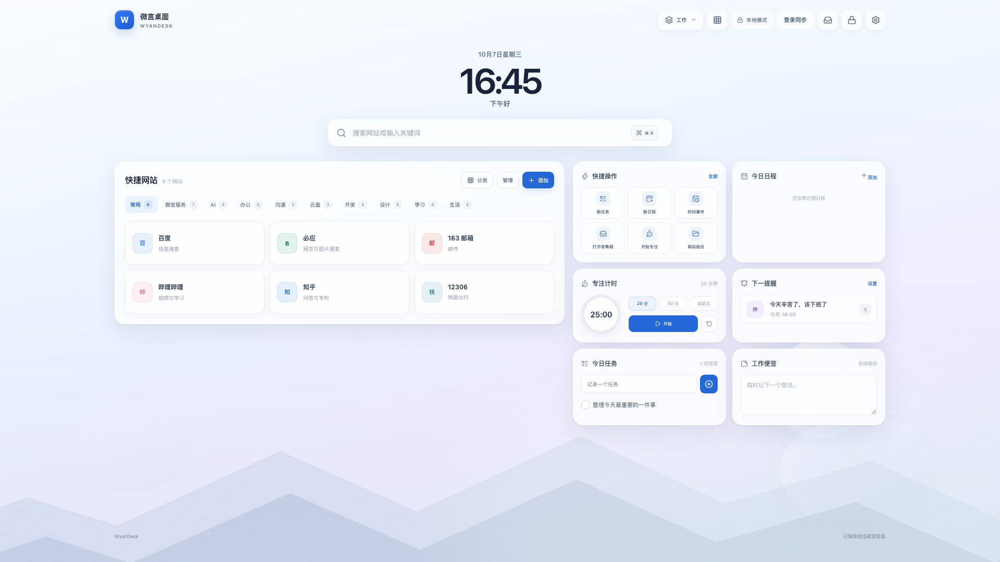

<p align="center">
  
</p>

<h1 align="center">WyanDesk</h1>

<p align="center">A calm, customizable browser desktop for bookmarks, tasks, schedules, notes, focus sessions, and reminders.</p>

<p align="center">
  <a href="https://desk.wyanhub.com"><strong>Live demo</strong></a> ·
  <a href="README.md">简体中文</a> ·
  <a href="https://github.com/lxshwyan/WyanDesk/releases">Extension downloads</a> ·
  <a href="https://gitee.com/lxsh_wyan/WyanDesk">Gitee mirror</a>
</p>



> The official site is live. Its footer shows the site filing number and links to the MIIT filing system. Local mode still requires no account or backend.

Repositories: [GitHub primary](https://github.com/lxshwyan/WyanDesk) · [Gitee China mirror](https://gitee.com/lxsh_wyan/WyanDesk). Development, issues, and pull requests are tracked on GitHub; Gitee is provided for access and distribution in China.

## Highlights

- Local-first data with optional account sync on the official deployment.
- Categorized bookmarks, multi-workspace layouts, quick commands, and website groups.
- Tasks with either a quick dialog or inline capture, schedules, notes, configurable focus sessions, time events, default workday reminders, custom reminders, and opt-in month-calendar, calculator, world-clock, and daily-overview widgets. The overview reuses existing desktop data; world clocks use browser time-zone data only and request no location or external API.
- A prominent header shortcut for layout editing, a task-first default widget order, two-column widget controls with smooth pointer-following per-workspace drag ordering, adjustable card sizes, frequency-based compact settings, multiple 3D-style scenes, custom backgrounds, reduced motion, and automatic high-resolution display scaling.
- Smooth full-screen privacy lock transitions with optional PIN and local-only activity summaries that stay silent after unlock and open only on request from Settings.
- Browser bookmark, ICS, desktop backup, and privacy-safe template import/export.
- Installable PWA and a Chrome / Edge new-tab extension with optional permissions.

## Quick start

Requires Node.js `^20.19.0` or `>=22.12.0`.

```bash
git clone https://github.com/lxshwyan/WyanDesk.git
cd WyanDesk
npm ci
npm run dev
```

Open `http://localhost:8097`. When the optional WyanDesk API is unavailable, the app automatically stays in local mode.

```bash
npm test
npm run typecheck
npm run build
npm run package:extension
```

## Docker

```bash
docker build -t wyandesk:local .
docker run --rm -p 8080:8080 wyandesk:local
```

Open `http://localhost:8080`. See [self-hosting](docs/SELF_HOSTING.md) for reverse proxy, PWA, and optional API notes.

## Privacy

WyanDesk stores data in browser `localStorage` by default. It does not include advertising or third-party behavioral analytics. Browser permissions are requested only when a related feature is used. See the [privacy notes](docs/PRIVACY.md) for details.

The open-source frontend does not include the WyanHub identity or sync backend. All local features remain available without it.

## Contributing

Issues and pull requests are welcome. Please read [CONTRIBUTING.md](CONTRIBUTING.md) and [SECURITY.md](SECURITY.md) first.

## License

[MIT](LICENSE) © 2026 WyanDesk contributors
